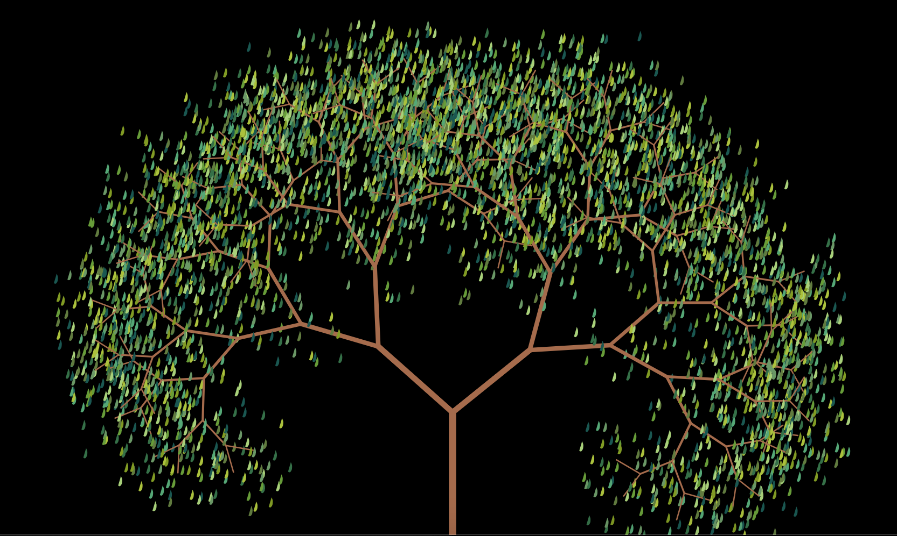
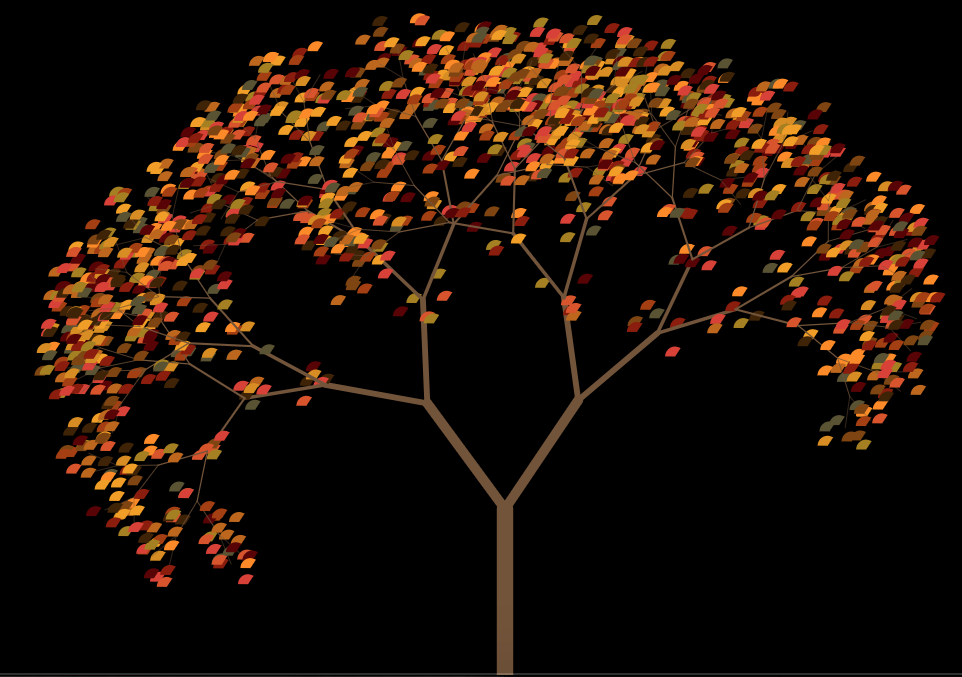
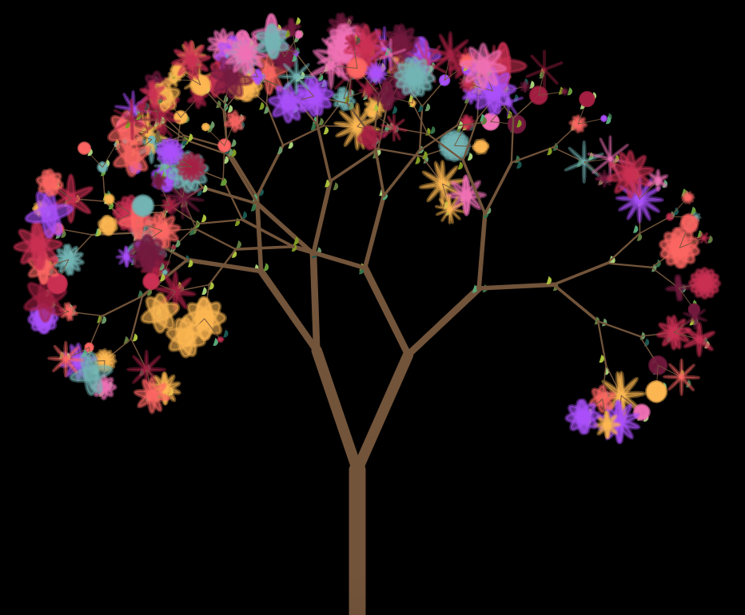
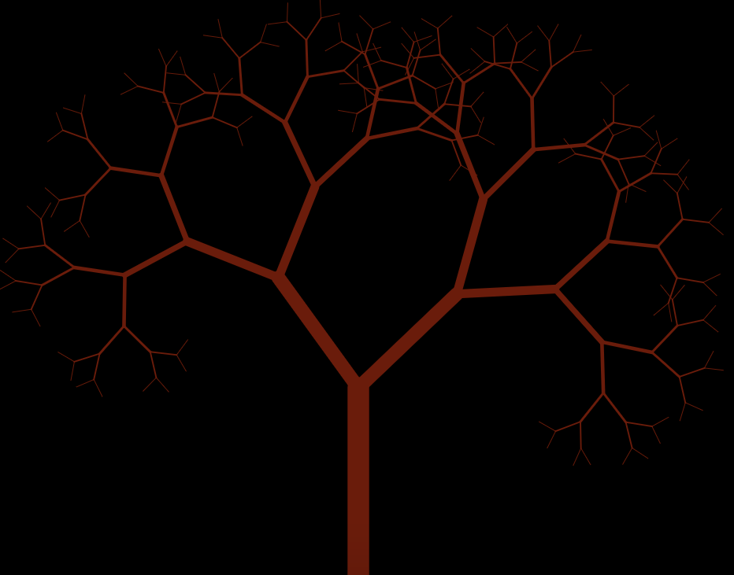

##  Fractal Tree 
Fractal tree generator, with an object oriented implementation in JavaScript, using the P5.js library. <br>
Check it out: https://delfifaing.github.io/fractal-tree-OOP/

### Some examples
<p float="left">
 
 
 
  
</p>

### Run Locally
```
$ git clone https://github.com/delfifaing/fractal-tree-OOP.git
$ cd snowflake
$ open index.html
```
